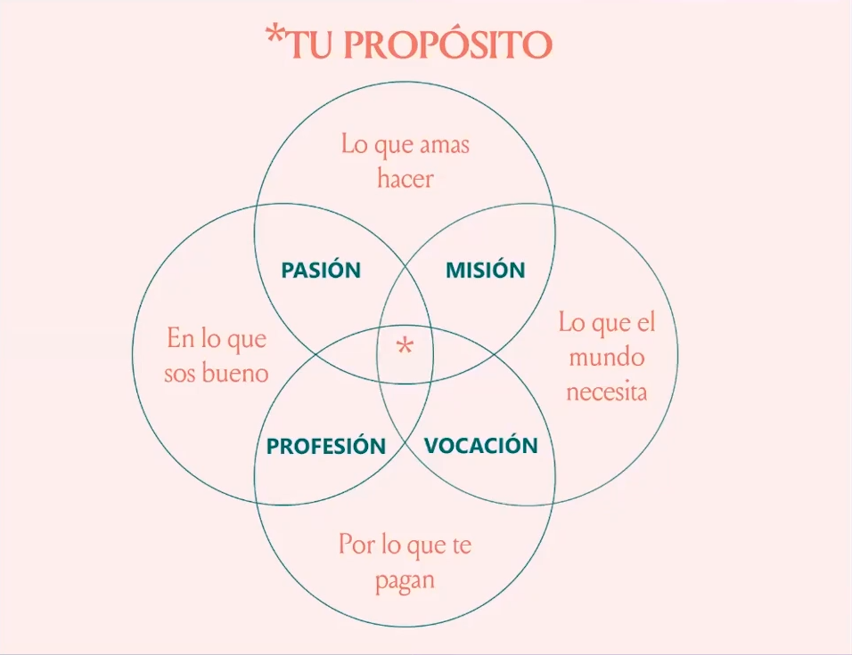

# Define tu propósito

> "Estamos biológicamente programados para seguir a nuestros pares"

Personas o marcas que crean lo mismo que nosotros.

Debemos encontrar un propósito que no solo nos guie hacia el éxito empresarial/financiera, sino que también nos motive como persona y equipo de trabajo, y que nos conecte emocionalmente con el cliente.

 
 

### ¿Por qué haces lo que haces?

que > como > por que (neocortex > límbico > reptiliano)

por que > como > que

Proposito (japones: Ikigai)

 

> "8 de cada 10 ciudadanos les influye en su compra que una marca sea honesta, confiable, transparente y coherente."

85% > Confianza
Una marca es una promesa, No te olvides de cumplirla.

82% > Honestidad
Si nos abrimos a las personas, ellas se abrirán a nosotros como consecuencia.

81% > Coherencia
Los valores no solo se declaran, se demuestran

80% > Transparencia
Las marcas empáticas escuchan y dialogan con sus públicos.

