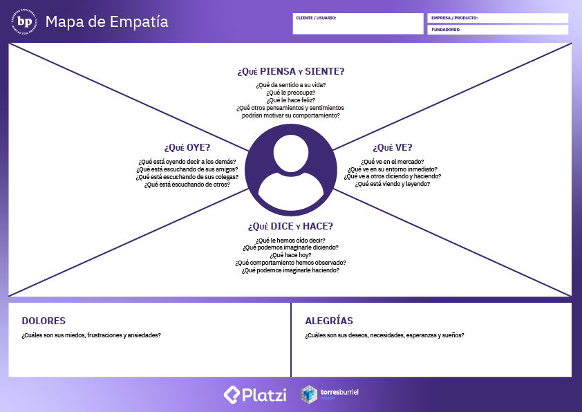
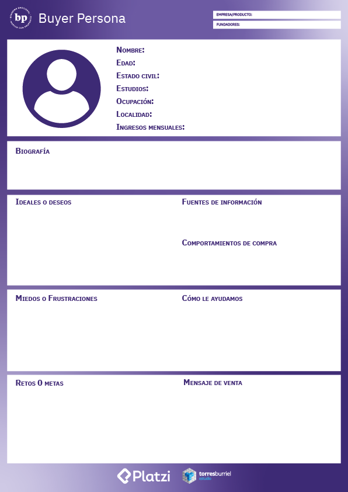

# Define tu cliente ideal

## ¿Por qué es importante definir nuestro target?
- Ayudará a generar contenido más específico que conecte con tu cliente ideal.
- Te permitirá invertir mejor tus recursos.
- Vas a crear relaciones a largo plazo con tus clientes.

 

## Empatiza con tu público

> "La gente olvidará lo que dijiste, olvidará lo que hiciste, pero nunca olvidará cómo la hiciste sentir"  
> Maya Angelou

Nuestro objetivo mas allá de llegar al *"top of mind* es llegar al *top of heart* de nuestro cliente

Para esto podemos servirnos de un mapa de empatía

 

## Define tu cliente ideal

> "Convierte al cliente en el héroe de tu historia"  
> Ann Handley

Toda estrategia de marca debe centrarse en él, entre más sepamos de el más sabremos como atraerlo hacia nuestra marca.

Para poder definir a tu cliente ideal también podemos hacer uso de otra herramienta similar al mapa de empatía, es el buyer persona.

 

estas son representaciones semificticias de tu cliente ideal, esto nos ayudara a definirlo, humanizarlo y entenderlo a mayor profundidad.

1. Para comenzar debemos definir sus características demográficas:
   - Nombre
   - Edad
   - Estado civil
   - Estudios
   - Ocupación
   - Localidad
   - Ingresos

2. Después una breve descripción:
   - Quien es
   - Que hace
   - Como es
   - Que quiere hacer

3. Fuentes de información:
   - Instagram y tiktok
   - Blogs
   - Google
   - facebook

4. comportamientos de compra:
   - Compra online (que sitios)
   - Compra fisica (en donde)

5. Ideales y deseos  

    

6. Miedos o frustraciones

    

7. Retos y metas

    

8. Como le ayudaremos

    

9. Mensaje de venta

    