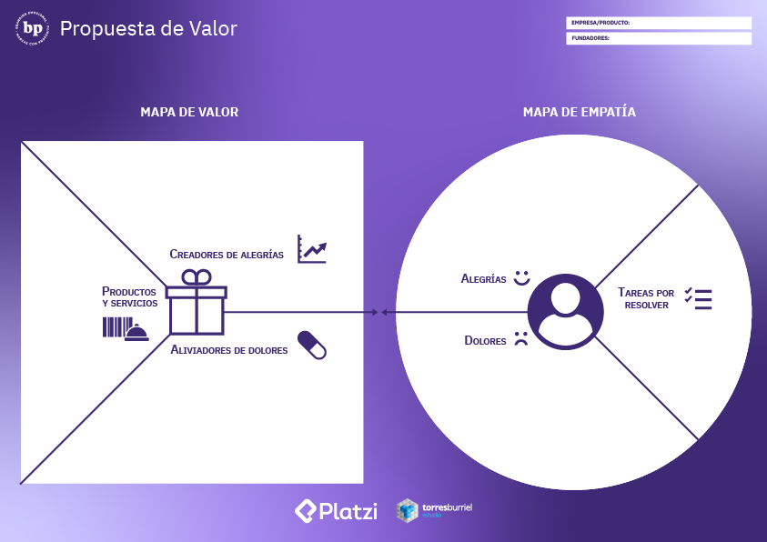

# Posicionamiento de marca

## Analiza tu competencia

Es muy importante saber quien es nuestra competencia para identificar cuales son nuestros puntos debiles frente a ellos y anticiparnos ante cualquier tipo de amenaza en el mercado.  
También para ver que es lo que nos hace diferentes de ellos.

 

## ¿Cómo hacer el análisis de la competencia?

- Identifica a tus competidores
- Compara el contenido de tu competencia
- Estudia su estrategia comercial y de marketing
- Compara tus ventajas competitivas y genera una estrategia

 

## Identifica la necesidad de tu audiencia

> "No encuentres clientes para tu producto. Encuentra productos para tus clientes"  
> Seth Godin

Esto es la propuesta de valor por excelencia.

**Mapa de Propuesta de valor**

